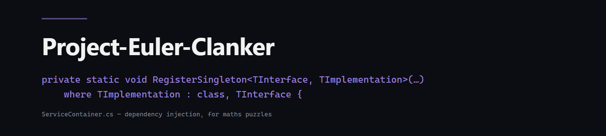

<div align="center">



# Project Euler, by a Clanker

**[Project Euler](https://projecteuler.net/) — the classic maths problems — solved in C#, then quietly buried under altogether too much architecture by an AI that got carried away.**

138 problems. A reflection-driven problem factory. A hand-rolled DI container. A parallel benchmark harness with a progress bar. For a console app that prints integers.


</div>

---

## What this is

[Project Euler](https://projecteuler.net/) is a collection of maths/programming problems where the honest deliverable is a single number. The sensible solution is a script.

This is not that. This is **138 Project Euler solutions** wrapped in the kind of layered, interface-driven, dependency-injected, reflection-discovered scaffolding you would normally reserve for software that does something. The maths is real and fast; the ceremony around it is the joke — and, underneath the joke, a genuinely tidy little C# codebase.

Every solution is verified against the known answer. All 138 run clean in **under 9 seconds** total.

```
138 passed, 0 failed, 0 errors — 8983 ms total
```

## Quick start

You need the [.NET 9 SDK](https://dotnet.microsoft.com/download).

```bash
# Verify every solution against its known answer, non-interactively
dotnet run -c Release -- --verify

# Or launch the interactive menu
dotnet run -c Release
```

### The menu

| Input | What it does |
|---|---|
| a number (e.g. `42`) | Solve and time one problem |
| `a` | Benchmark a range of problems in parallel, with a report |
| `t` | Run the scratch `Test` routine |
| `--verify` *(CLI flag)* | Run all problems against the answer key and exit `0`/`1` |

Individual and range benchmarks JIT-warm each solution, force a clean GC for single runs, and time 100 iterations to report the best/mean/worst — overkill, lovingly.

## The "too much architecture", annotated

Every piece below is real, works, and is far more than this app needs. That is the point.

- **`ProblemFactory`** — discovers solutions by **reflection** at startup. Every `ProblemNNN` class that derives from the abstract `Problem` base is found, keyed by number, and instantiated on demand via `Activator.CreateInstance`. Adding `Problem139.cs` is the entire registration step; nothing else changes.
- **`ServiceContainer`** — a **hand-rolled dependency-injection container**. Singletons for `IProblemSolver`, `IOutputHandler`, and `IStatisticsCalculator`, resolved by type. (Yes, `Microsoft.Extensions.DependencyInjection` exists. We have chosen violence.)
- **`ProblemSolver`** — a **parallel benchmark engine**. `Parallel.ForEach` across a problem range, a background thread rendering a live progress bar, ordered result aggregation, and a generated report.
- **`Library`** — a shared maths toolkit so no solution re-implements the basics (see below).
- **`TestRunner`** — a non-interactive **answer-key harness** wired to the `--verify` flag, returning a CI-friendly exit code.
- **`BenchmarkConfig`** — every magic number (warm-up runs, progress-bar width, output file names) pulled into one place, because of course it is.

```
Program ──> ServiceContainer ──> IProblemSolver ──> ProblemFactory ──(reflection)──> ProblemNNN
                  │                     │
                  └─> IOutputHandler    └─> IStatisticsCalculator
```

## The shared maths toolkit (`Library.cs`)

The actually-reusable bit. Solutions lean on a common, fast core instead of copy-pasting primality tests:

| Area | Helpers |
|---|---|
| Primes | Sieve of Eratosthenes (`bool[]` and `BitArray`), precomputed sieve lookups, cached `IsPrime(int/long)`, `GetPrimeList` |
| Digits | `SumDigits`, `DigitCount`, `NumDigits`, `IsPalindrome` (int/long/string), `IsPandigital` / `IsPanDigital`, `SameDigits` |
| Number theory | `Gcd`, `Factorial` (`BigInteger`), `IntFactorial`, `Pow10`, `IsPentagon` |
| Arrays | next-permutation `Permute`, file readers for the `data/` inputs |

Where it counts, the solutions reach for real techniques — smallest-prime-factor sieves for O(log n) divisor counts, deterministic Miller–Rabin for large primality, modular exponentiation instead of `BigInteger`, bit-mask digit signatures, and descending search with early termination. See [`CHANGELOG.md`](CHANGELOG.md) for a per-problem optimisation log from an earlier performance pass.

## Project layout

```
.
├── Program.cs              Entry point: --verify flag or interactive menu loop
├── ProblemFactory.cs       Reflection-based discovery + instantiation of solutions
├── ServiceContainer.cs     Hand-rolled DI container (singletons by type)
├── Library.cs              Shared maths toolkit (primes, digits, number theory)
├── TestRunner.cs           Answer-key verification harness (drives --verify)
├── BenchmarkConfig.cs      Central tuning constants
├── InputHandler.cs         Console input parsing for the menu
├── Interfaces/             IProblemSolver, IOutputHandler, IStatisticsCalculator
├── Services/               ProblemSolver, OutputHandler, StatisticsCalculator
├── Models/                 ProblemData, BenchmarkData, ProblemStatistics
├── Problems/               Problem.cs (base) + Problem001..Problem138
└── data/                   Puzzle inputs (poker.txt, names.txt, matrices, ciphers, …)
```

## Adding a problem

1. Create `Problems/ProblemNNN.cs` deriving from `Problem`, implementing `object Solve()`.
2. (Optional) add the known answer to the `ExpectedAnswers` map in `TestRunner.cs`.

The factory finds it automatically — no registration, no switch statement, no wiring.

## Verification status

All **138** implemented problems run without error. The answer-key harness verifies the first **130** against their published Project Euler answers (the 8 most recent solutions run clean but aren't yet in the key). Re-run any time with:

```bash
dotnet run -c Release -- --verify
```

## License

[MIT](LICENSE) © 2026 Giftedx. The maths belongs to [Project Euler](https://projecteuler.net/); please don't post the answers where new solvers will trip over them.

---

<div align="center"><sub>Part of the <a href="https://github.com/Giftedx">Giftedx</a> workshop. A clanker is what got carried away here — the maths still checks out.</sub></div>
